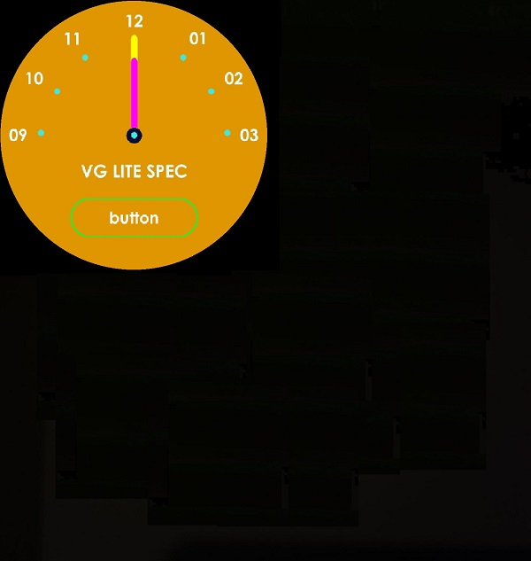

# NXP Application Code Hub
[](https://www.nxp.com)

## AN13768: Switch LCD Display On/Off in Low-Power Mode on i.MX RT1170
This application note describes how to add low-power mode operation on the Mobile Industry Processor Interface (MIPI) Display Serial Interface (DSI) host controller and LCDIFv2 controller. It is done to drive a DSI-compliant LCD panel on i.MX RT1170 to switch off and then back on again. 

In this application note, software mode is used to enter and exit from the sleep mode and DISPLAY MIX is switched off to save maximum power. This document uses SSARC to save and restore LCDIFV2 and Video mux related registers when it is switched off and switched on back. Here, we have modified the `clock_freertos (vglite_examples)` included with the SDK to understand how to power up and power down the display. The `clock_freertos` project shows how to drive the TFT panel using the LCDIFv2 driver. The example toggles between display off and on for certain interval in an infinite loop.

#### Boards: MIMXRT1170-EVK
#### Categories: Graphics
#### Peripherals: DISPLAY
#### Toolchains: MCUXpresso IDE

## Table of Contents
1. [Software](#step1)
2. [Hardware](#step2)
3. [Setup](#step3)
4. [Results](#step4)
5. [FAQs](#step5) 
6. [Support](#step6)
7. [Release Notes](#step7)

## 1. Software<a name="step1"></a>

The software for this Application Note is delivered in raw source files and MCUXpresso IDE projects.
- MCUXpresso SDK 2.11.0
- MCUXpresso IDE, version is 11.5.0 or later

## 2. Hardware<a name="step2"></a>

- [MIMXRT1170-EVK](https://www.nxp.com/design/development-boards/i-mx-evaluation-and-development-boards/i-mx-rt1170-evaluation-kit:MIMXRT1170-EVK) (all Rev boards are supported)
- RK055HDMIPI4M or [RK055HDMIPI4MA0](https://www.nxp.com/part/RK055HDMIPI4MA0) MIPI display panel
- Micro USB Cable
- Personal computer


## 3. Setup<a name="step3"></a>
1. Connect a USB cable between the host PC and the OpenSDA USB ort on the target board.
1. Open a serial terminal with the following settings:
   - 115200 baud rate
   - 8 data bits
   - No parity
   - One stop bit
   - No flow control
1. Import the existing project from MCUXpresso IDE
1. Compile the project.
1. Download the built image to the board through debug probe USB port and run the example.

## 4. Results<a name="step4"></a>
The similar log below shows the output of the examples in the terminal window:
```
61 frames in 1 seconds: 58 fps
61 frames in 1 seconds: 58 fps
61 frames in 1 seconds: 58 fps
```
At the same time, the clock is showed on the display. The display is powered off and powered on again and again after a while.



## 5. FAQs<a name="step5"></a>


## 6. Support<a name="step6"></a>

The details for this demo are all recorded in the application note - [AN13768](https://www.nxp.com/docs/en/application-note/AN13768.pdf) Switch LCD Display On/Off in Low-Power Mode on i.MX RT1170.

#### Project Metadata
<!----- Boards ----->
[](https://github.com/search?q=org%3Anxp-appcodehub+MIMXRT1170-EVK+in%3Areadme&type=Repositories)

<!----- Categories ----->
[](https://github.com/search?q=org%3Anxp-appcodehub+graphics+in%3Areadme&type=Repositories)

<!----- Peripherals ----->
[](https://github.com/search?q=org%3Anxp-appcodehub+display+in%3Areadme&type=Repositories)

<!----- Toolchains ----->
[](https://github.com/search?q=org%3Anxp-appcodehub+mcux+in%3Areadme&type=Repositories)

Questions regarding the content/correctness of this example can be entered as Issues within this GitHub repository.

>**Warning**: For more general technical questions regarding NXP Microcontrollers and the difference in expected funcionality, enter your questions on the [NXP Community Forum](https://community.nxp.com/)

[](https://www.youtube.com/@NXP_Semiconductors)
[](https://www.linkedin.com/company/nxp-semiconductors)
[](https://www.facebook.com/nxpsemi/)
[](https://twitter.com/NXP)

## 7. Release Notes<a name="step7"></a>
| Version | Description / Update                           | Date                        |
|:-------:|------------------------------------------------|----------------------------:|
| 1.0     | Initial release on Application Code HUb        | June 12<sup>th</sup> 2023 |

